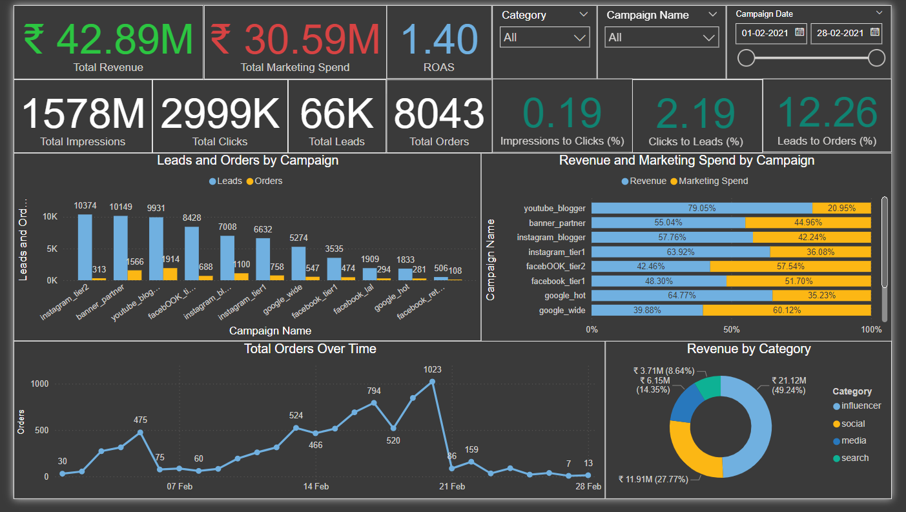

# Live End-to-End Business Funnel Dashboard

## Project Overview
This dashboard provides a comprehensive view of our marketing and sales funnel, leveraging real data to drive business decisions. As an aspiring data analyst, I developed this interactive visualization to demonstrate my ability to translate raw data into actionable insights.

Data Source: [Marketing Spending Dataset](https://www.kaggle.com/datasets/sinderpreet/analyze-the-marketing-spending?resource=download)

## Dashboard Components

### Key Performance Indicators (KPIs)
- Total Revenue: ₹42.89M
- Total Marketing Spend: ₹30.59M
- ROAS (Return on Ad Spend): 1.40
- Total Impressions: 1578M
- Total Clicks: 2999K
- Total Leads: 66K
- Total Orders: 8043

### Funnel Metrics
- Impressions to Clicks: 0.19%
- Clicks to Leads: 2.19%
- Leads to Orders: 12.26%

### Interactive Filters
- Category: Allows filtering by marketing channel category
- Campaign Name: Enables analysis of individual campaign performance
- Date Range Slider: Facilitates time-based analysis from 01-02-2021 to 28-02-2021

### Visualizations
1. **Leads and Orders by Campaign (Bar Chart)**
   - Compares lead generation and order conversion across campaigns
   - Insight: 'instagram_tier2' generates the most leads, while 'banner_partner' converts the most orders

2. **Revenue and Marketing Spend by Campaign (Stacked Bar Chart)**
   - Visualizes the revenue-to-spend ratio for each campaign
   - Insight: 'youtube_blogger' has the highest revenue percentage relative to spend

3. **Total Orders Over Time (Line Graph)**
   - Tracks daily order trends
   - Insight: Significant spike in orders around February 21st, followed by a sharp decline

4. **Revenue by Category (Donut Chart)**
   - Breaks down revenue contribution by marketing category
   - Insight: 'Influencer' marketing contributes the largest share (49.24%) of revenue

## Business Impact and Insights

1. **Campaign Efficiency:**
   - The ROAS of 1.40 indicates that for every rupee spent on marketing, we generate ₹1.40 in revenue.
   - Campaigns like 'youtube_blogger' and 'banner_partner' show high efficiency in converting spend to revenue.

2. **Funnel Optimization Opportunities:**
   - The low Impressions to Clicks rate (0.19%) suggests room for improvement in ad creatives or targeting.
   - A Leads to Orders rate of 12.26% indicates potential for enhancing lead nurturing strategies.

3. **Category Performance:**
   - Influencer marketing is the top revenue driver, suggesting potential for increased investment in this category.
   - The 'search' category, contributing 8.64% of revenue, might benefit from optimization or increased budget allocation.

4. **Temporal Trends:**
   - The significant order spike followed by a decline in late February warrants investigation into potential causes (e.g., promotional event, external factors) and strategies to sustain performance.

5. **Campaign-specific Insights:**
   - 'instagram_tier2' excels at lead generation but has lower order conversion, indicating a need for improved lead qualification or follow-up processes.
   - 'banner_partner' shows strong order conversion, suggesting its strategies could be applied to other campaigns.

## Skills Demonstrated
- Data visualization and dashboard design using Excel and Power BI
- ETL processes and data modeling
- Marketing metrics analysis and interpretation
- Interactive filtering and dynamic visualizations
- Deriving actionable insights from complex datasets

## About the Creator  
Rishav Singh Rajput - Aspiring Data Analyst  
Email - rishavsrajput@gmail.com  
LinkedIn Profile - [www.linkedin.com/in/rishav-rajput](https://www.linkedin.com/in/rishav-rajput)

I'm passionate about turning data into actionable insights and am actively seeking opportunities in data analytics. Feel free to reach out to discuss this project or potential collaborations!
